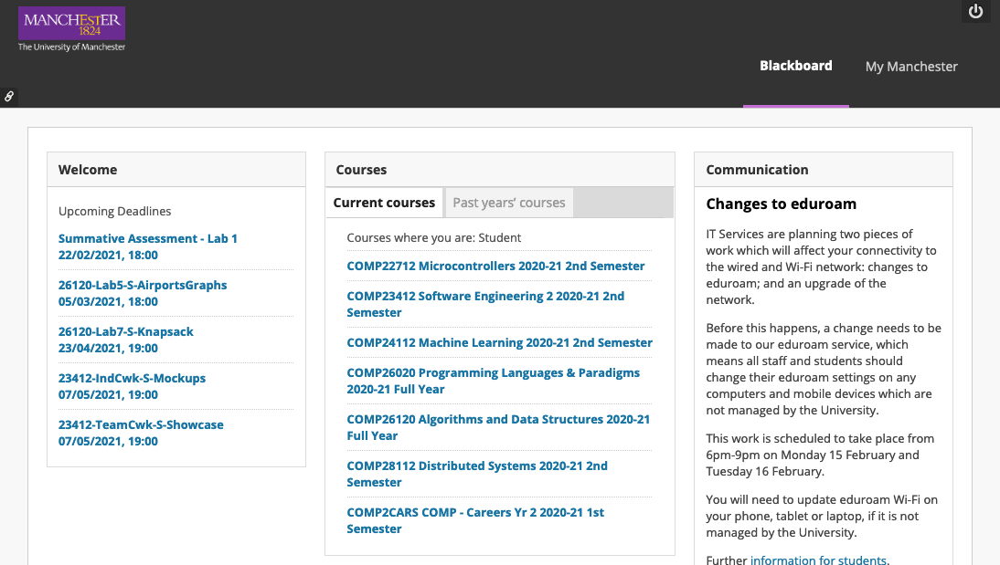

# Better Blackboard

This extension makes some minor modifications to the University of Manchester Blackboard homepage to make it more usable:
- Replace the 'welcome' image with a list of upcoming deadlines, and submission links
- Hide previous semester course units from the "Current courses" tab

This extension & parts of the readme are based on the [web-extension-starter](https://github.com/abhijithvijayan/web-extension-starter) repository.

## Development
- `yarn install` to install dependencies.
- `yarn run dev:chrome` to start the development server for chrome extension
- `yarn run dev:firefox` to start the development server for firefox addon
- `yarn run dev:opera` to start the development server for opera extension
- `yarn run build:chrome` to build chrome extension
- `yarn run build:firefox` to build firefox addon
- `yarn run build:opera` to build opera extension
- `yarn run build` builds and packs extensions all at once to extension/ directory

## Installing Extension
### Chrome
- Go to the browser address bar and type `chrome://extensions`
- Check the `Developer Mode` button to enable it.
- Click on the `Load Unpacked Extension…` button.
- Select your extension’s extracted directory.

### Firefox
- Load the Add-on via `about:debugging` as temporary Add-on.
- Choose the `manifest.json` file in the extracted directory

### Opera
- Load the extension via `opera:extensions`
- Check the `Developer Mode` and load as unpacked from extension’s extracted directory.
